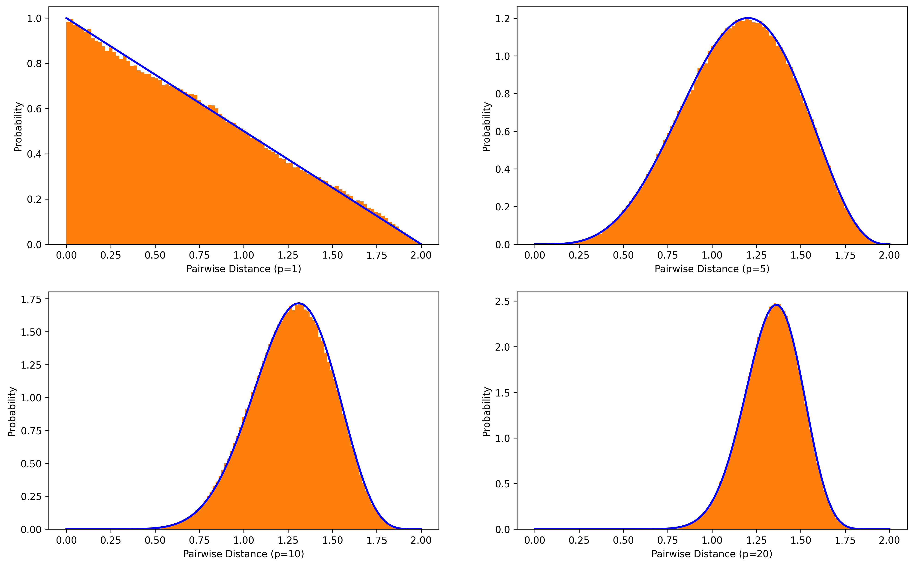
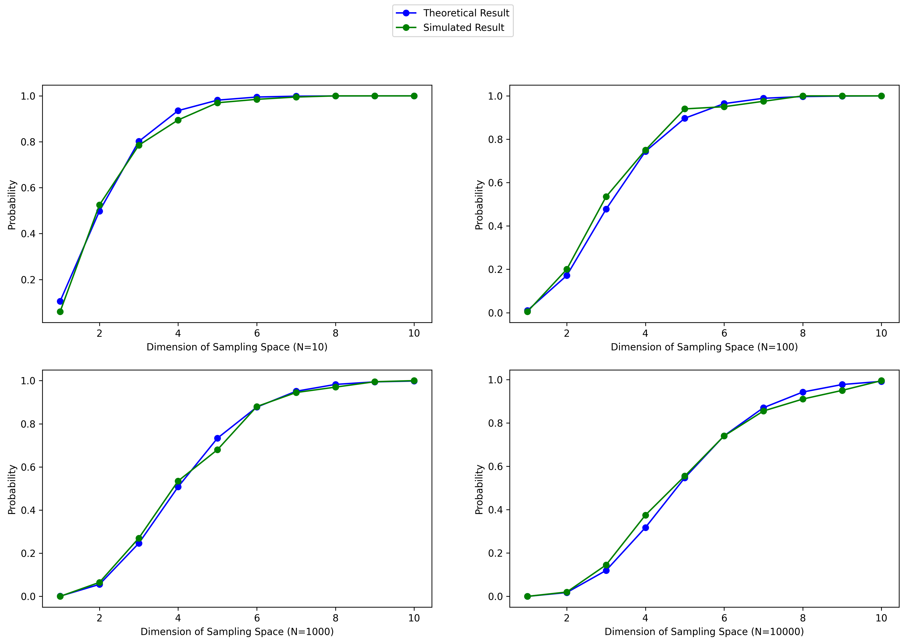

# Curse of Dimensionality in Uniform p-ball Sampling Space

- by Yuehao Wang
- Mar 15, 2020

## Background

Curse of dimensionality reveals the fact that all sample points are going to become sparse and tend to the edge of the sampling space in high dimensions, which is a common problem in machine learning. This article is going to verify curse of dimensionality under a sampling space of a unit p-ball.

As suggested by *The Elements of Statistical Learning* [1], most data points obtained by uniformly random sampling are closer to the boundary of the sampling space than to any other data points. This statement seems  contradictive because if most data points gather along the edge of sampling space, distances between data points are supposed to be closer.

A theoretical derivation along with a numerical computation and simulation was conducted to verify the correctness of the statement. To simplify the sampling, suppose the sampling space is a unit p-ball, i.e a p-dimensional sphere with radius 1, and data points are i.i.d uniformly distributed in the unit p-ball.

## Theoretical Derivation

Our hypothesis is that most data points are closer to the edge than to other data points in high-dimentional space. To verify the hypothesis, we need to measure two kinds of distances:

1. Minimal distance between two points.
2. Distance between a data point and the edge of sampling space.

Then we can compare the two kinds of distances and find our result.

Suppose there is an i.i.d uniform sampling in the unit p-ball space: $$S_1 \dots S_N$$ (totally $$N$$ samples). Denote distances between $$S_1$$ and $$S_i$$ as $$Y_i$$, where $$i\in\{2, \dots, N\}$$. Denote distance between $$S_1$$ and the edge of the p-ball as $$X_1$$.

Distance (denoted as $$D(\cdot,\cdot)$$) between a uniformly sampled data point $$p$$ and the origin $$o$$ of the unit p-ball has the CDF:

$$P(D(p, o)\leq r)=V(r)/V(1)$$, where $$V(r)=\frac{\pi^{p/2}}{(p/2)!}r^p$$ is the volume of p-ball with radius $$r$$. Thus, we have $$P(D(p, o)\leq r)=r^p$$. Then find the PDF by derivative with regard to $$r$$: $$P(D(p, o)= r)=p\cdot r^{p-1}$$. The relation that $$X_1 = 1-D(S_1, o)$$ derives the PDF of $$f(x)=P(X_1=x)=p(1-x)^{p-1}$$ by change of variable.

A mathematical research [2] presents a random pairwise distance distribution (Eq 1.) of uniformly distributed points in a p-dimensional sphere with radius equal to $$R$$. Since $$S_1$$ and any other data points are i.i.d uniformly sampled in a unit p-ball, exactly $$g(y) = P(Y_i=y)=P_{p, 1}(y)$$.
$$
P_{p,R}(s)=\frac{s^{p-1}\int_{s/2}^R (R^2-x^2)dx}{\frac{1}{2p}Beta(\frac{p}{2}+\frac{1}{2}, \frac{1}{2})R^{2p}} \quad\quad\quad \text{(Eq 1.)}
$$
Also denote $$G(y)$$ as the CDF of $$g(y)$$ and $$F(x)$$ as the CDF of $$f(x)$$.

Denote $$Y_{(1)}$$ as the minimal pairwse distance between $$S_1$$ and other data points. Due to order statistic [3],
$$
H(y) = P(Y_{(1)} > y) = (1-G(y))^{N-1}
$$
Then we find the PDF of $$Y_{(1)}>X_1$$:
$$
P(Y_{(1)}>X_1)=\int_0^1 H(y)f(x) dx
$$
Finally, we can solve the integral with numerical computing to find the probability that data points are closer to the edge than to other data points. If the probability is greater than 0.5, we can accept the hypothesis.

## Simulation

A simulative experiment is carried out to testify the validity of our theoretical derivation. In the simulation, $$N$$ data points are uniformly sampled inside a unit p-ball space via an algorithm provided in [4]. Subsequently, compute distance between the first sampled data point $$S_1$$ and the edge of the p-ball (i.e. $$X_1$$) and the minimal pairwise distance between $$S_1$$ and other data points (i.e. $$Y_{(1)}$$). Repeat the sampling process for 200 times and compute the proportion of $$Y_{(1)} > X_1$$. The proportion approximates the probability of the occurrance of our hypothesis.

## Experiments

The first experiment aims to check correctness of the random distance distribution. Figure below shows a highly matching result between simulation (orange) and theoretical computation (blue), which confirms validity of the random distance distribution.

The next figure compares theoretical result and simulated result of the probability that data points are closer to the edge of sampling space than to other data points. Since the sparsity of the sampling space depends on the number of samples ($$N$$) and the dimensions of the space ($$p$$), the figure exhibits four subplots which are under different $$N$$ (10, 100, 1000, 10000) and plot the probability changing curves over $$p$$ (from 1 to 10).

Theoretical result and simulated result are displayed in blue and green, respectively. We can see the two curves have the same tendency and roughly overlapped with each other under different $$N$$.

Generally speaking, the probabilities climb up with the increasing of $$p$$ and finally level up to 1, which suggests that distances between sampled data points will sharply ascend such that most data points are closer to the edge instead of to other data points. With exponential increasing of the $$N$$, the density of sampling will rise up, leading to the slowing down of probability change rates. However, the probabilities stay around 1.0 when dimension of the sampling space is 10, even $$N=10000$$.

You can download the source code of experiments [here](sparsity_high_dim.ipynb) and see the complete implementation.

## Conclusion

Indeed, most data points obtained by uniformly random sampling are closer to the edge of the sampling space than to any other data points. In high-dimensional sampling space, although data points are more likely to locate closer to the edge, distances between data points will become more larger, resulting in severe sparsity of  high-dimensional sampling spaces. Further study can focus on a more general and complex sampling space for example a hypercube and explore a feasible sampling method to alleviate the problem.

## References

[1]: Friedman, Jerome, Trevor Hastie, and Robert Tibshirani. *The elements of statistical learning*. Vol. 1. No. 10. New York: Springer series in statistics, 2001.

[2]: Tu, Shu-Ju, and Ephraim Fischbach. "Random distance distribution for spherical objects: general theory and applications to physics." *Journal of Physics A: Mathematical and General* 35.31 (2002): 6557.

[3]: Wikipedia. [Order Statistic](https://en.wikipedia.org/wiki/Order_statistic).

[4]: Stackoverflow. [Picking random points in the volume of sphere with uniform probability](https://math.stackexchange.com/questions/87230/picking-random-points-in-the-volume-of-sphere-with-uniform-probability).

